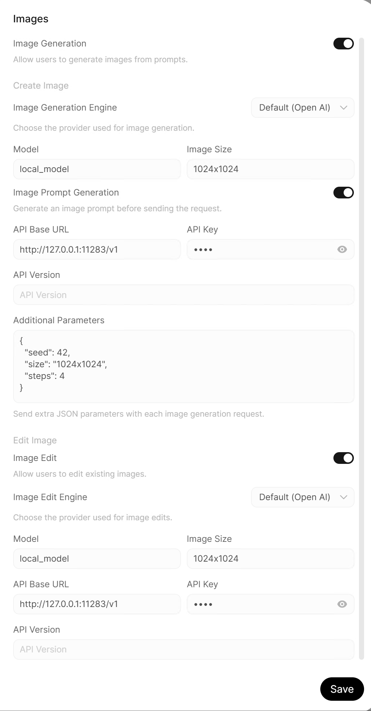

# VigenFlow

**FLUX and Z-Image on the NPU of an AMD Ryzen AI laptop, several times faster than the same laptop's integrated GPU.**

Local image generation and editing with **CPU + AMD NPU inference**, connected to **OpenWebUI Desktop**.

The latest release, **[v0.2.0 Beta 1](https://github.com/jia1217/vigenflow/releases/latest)**, uses **BFP16 weights for all supported models**, adds **FLUX.1-schnell**, and serves **image editing** next to the text-to-image models.

---

## 🎨 Gallery

Every image below was generated by VigenFlow v0.2.0 Beta 1 on the NPU from the prompt shown under it, with the default settings: 1024 × 1024, 4 steps, seed 42. Try the same prompts on your own NPU.

<details open>
<summary><b>FLUX.1-schnell</b></summary>
<br>
<table>
  <tr>
    <td width="33%" valign="top"><br><sub>A cozy reading nook by a rain-streaked window, warm lamp light, stacks of old books, a sleeping orange cat curled up on a knitted blanket, cinematic photo</sub></td>
    <td width="33%" valign="top"><br><sub>A red fox standing in a snowy pine forest at sunrise, soft golden light, its breath visible in the cold air, wildlife photography</sub></td>
    <td width="33%" valign="top"><br><sub>A watercolor painting of a small lighthouse on a rocky island, seagulls overhead, pastel sunset sky</sub></td>
  </tr>
</table>
</details>

<details>
<summary><b>FLUX.2-klein-4B</b></summary>
<br>
<table>
  <tr>
    <td width="33%" valign="top"><br><sub>A cafe chalkboard sign that says "FRESH COFFEE" in hand-lettered white chalk, a steaming cup of coffee beside it, warm morning light</sub></td>
    <td width="33%" valign="top"><br><sub>Macro photo of a dew-covered green leaf with a tiny ladybug, shallow depth of field, soft morning light</sub></td>
    <td width="33%" valign="top"><br><sub>Paper-cut art of a koi fish swimming among lotus flowers, layered colored paper, soft shadows between the layers</sub></td>
  </tr>
</table>
</details>

<details>
<summary><b>Z-Image-Turbo</b></summary>
<br>
<table>
  <tr>
    <td width="33%" valign="top"><br><sub>Portrait photo of an elderly fisherman with a weathered face and a knitted wool cap, harbor in the background, overcast natural light, 85mm lens</sub></td>
    <td width="33%" valign="top"><br><sub>A neon sign reading "OPEN LATE" glowing in the window of a small ramen shop on a rainy street at night, reflections on the wet pavement</sub></td>
    <td width="33%" valign="top"><br><sub>A bowl of fresh fruit salad on a white marble countertop, top-down food photography, bright natural light</sub></td>
  </tr>
</table>
</details>

---

## 🎬 Demo

- ⚡ **[v0.2 speed demo](https://www.youtube.com/watch?v=2mQH2Q0H6Nc&list=PLcZNuhm1Td94)**: VigenFlow generating images on the NPU.
- 🛠️ **[Setup walkthrough](https://youtu.be/kZaqCE0LnRA?si=5h6zOFKBfm6EKJv9)**: how to set up and use VigenFlow with OpenWebUI Desktop.
- 📱 **[Short demo](https://youtube.com/shorts/dwDsCnBObzQ?si=Aq4BZV3zcW51KjQa)**

> **Note:** If you are using the latest version of OpenWebUI Desktop, we recommend switching to the stable version shown in the setup walkthrough to avoid compatibility issues.

---

## 🧠 Supported Models

| Model | Model ID | Task | Denoising steps |
| --- | --- | --- | ---: |
| **FLUX.1-schnell** | `flux1-schnell` | Text-to-image | 4 |
| **FLUX.2-klein-4B** | `flux2-klein-4B` | Text-to-image | 4 |
| **FLUX.2-klein-4B Edit** | `flux2-klein-4B-edit` | Image-to-image | 4 |
| **Z-Image-Turbo** | `z-image-turbo` | Text-to-image | 4 or 8 |

All models use BFP16 weights, run on both Windows and Ubuntu, and make 1024 × 1024 images. You can switch between them in the OpenWebUI model list without restarting `vgf-serve`.

---

## 🔜 Next Steps

Planned for a future release:

- [ ] **Krea2-Turbo** support.
- [ ] **Qwen-Image 2.1** support.
- [ ] **LoRA support** for the BFP16 model pipelines. If you need LoRA today, use [v0.1.2](https://github.com/jia1217/vigenflow/releases/tag/v0.1.2).

---

## 🚀 Getting Started

Check that you have everything below before you download VigenFlow:

- [ ] **An AMD Ryzen AI 300-series processor** with an XDNA 2 NPU (`npu2`). VigenFlow is tested on the [AMD Ryzen AI 9 HX 370](https://www.amd.com/en/newsroom/press-releases/2024-10-10-amd-launches-new-ryzen-ai-pro-300-series-processo.html); other processors need matching NPU binaries and runtime support.
- [ ] **Windows x64 or Ubuntu 24.04 x86_64.**
- [ ] **The NPU driver is installed.**
  - Windows: install the NPU driver from AMD's [Driver Download](https://www.amd.com/en/support/download/drivers.html) page. **NPU Compute Accelerator Device** should then appear in Device Manager.
  - Ubuntu: install the AMD XDNA driver and a matching XRT runtime by following the [AMD XDNA / MLIR-AIE installation guide](https://github.com/Xilinx/mlir-aie). `xrt-smi examine` should then list the NPU.
- [ ] **About 56 GB of free disk space** for all three models: 46 GB of weights, plus up to 10 GB while downloading. You can skip models to download less (see [Step 3](#-step-3-download-the-model-weights-one-time)).
- [ ] **OpenWebUI Desktop** is installed.

---

## 📦 Installation

Download the package for your system, extract it, download the model weights once, and start the server. The weights are not included in the packages; Step 3 downloads them from Hugging Face.

### 📥 Step 1: Download the Release Package

Go to the [Latest Release](https://github.com/jia1217/vigenflow/releases/latest) page and download the package for your operating system:

- 🐧 Ubuntu: `vigenflow_0.2.0-beta.1_ubuntu_amd64.zip`
- 🪟 Windows: `vigenflow_0.2.0-beta.1_windows_amd64.zip`

To be notified about new releases, click **Watch → Custom → Releases** on the [VigenFlow repository](https://github.com/jia1217/vigenflow) page.

### 📂 Step 2: Extract the Package

Extract the downloaded `.zip` package to your desired location.

#### 🐧 Ubuntu

The Ubuntu package needs a few runtime libraries. XRT comes with the AMD XDNA driver installation from [Getting Started](#-getting-started).

```bash
sudo apt install libboost-program-options1.83.0 libgomp1 libpng16-16t64 curl unzip
unzip vigenflow_0.2.0-beta.1_ubuntu_amd64.zip
cd vigenflow_0.2.0-beta.1_ubuntu_amd64
```

#### 🪟 Windows

Extract the ZIP package manually, then open **PowerShell** inside the extracted `vigenflow_0.2.0-beta.1_windows_amd64` folder.

### 💾 Step 3: Download the Model Weights (One Time)

`prepare_base.exe` downloads the pre-packed NPU weights from [Kelsey1217/vigenflow-npu-weights](https://huggingface.co/Kelsey1217/vigenflow-npu-weights) into the `all_model_weights` folder. No Hugging Face account is needed.

#### 🐧 Ubuntu

```bash
./prepare/prepare_base.exe
```

#### 🪟 Windows

```powershell
.\prepare\prepare_base.exe
```

All three models together are about **46 GB** (FLUX.1-schnell 27 GB, Z-Image-Turbo 12 GB, FLUX.2-klein-4B 8 GB), plus up to 10 GB of free space while downloading. The edit model uses the FLUX.2-klein-4B weights. To skip a model, set `"enabled": false` for it in `prepare/prepare_models.jsonc` before running the command.

You can run `prepare_base.exe` again at any time. It only downloads models whose weights have changed, and it resumes an interrupted download.

### ▶️ Step 4: Launch VigenFlow Server

All models are served at once, so you don't need to give a model name when starting the server.

#### 🐧 Ubuntu

```bash
cd server_running
./vgf-serve
```

#### 🪟 Windows

```powershell
cd server_running
.\vgf-serve.exe
```

The server listens on port **11283** and makes all supported models available to OpenWebUI. To see all server options, run `./vgf-serve -h` (Ubuntu) or `.\vgf-serve.exe -h` (Windows).

---

## 🔗 Connect with OpenWebUI Desktop

After launching `vgf-serve`, open **OpenWebUI Desktop** and configure it for your local VigenFlow server. All settings below are in OpenWebUI's **Admin Panel → Settings**.

1. **Add the connection.** In **Connections**, add an OpenAI API connection with this URL:

   ```text
   http://127.0.0.1:11283/v1
   ```

   Keep **API Type** set to **Chat Completions** (the default). No API key is needed. The VigenFlow models then appear in the model list.
2. **Turn on image generation.** In **Images**, turn on **Image Generation**, keep the engine set to **OpenAI**, set the API base URL to `http://127.0.0.1:11283/v1`, and type any text as the API key, then click **Save**. OpenWebUI will not save this setting without a key; VigenFlow ignores it.
3. **Set up each model.** In **Models**, edit each VigenFlow model:
   - Set **Function Calling** to **Native** in its advanced parameters. Recent OpenWebUI versions already use Native by default.
   - Keep **Image Generation** and **Builtin Tools** checked under Capabilities.
   - For `flux2-klein-4B-edit`, also check **Vision** so you can attach images.
4. **Generate an image.** In a chat, pick a VigenFlow model, open **Integrations** in the message box and turn on **Image**, then type your prompt.

The screenshot shows the **Images** settings page set up for VigenFlow.



---

## 📄 License

The VigenFlow source code is licensed under the [Apache License 2.0](LICENSE).

Model weights are **not** covered by this license. Each model and LoRA keeps its original license, including the BFP16 weights in the release packages. See [MODEL_LICENSES.md](MODEL_LICENSES.md) for each model's license and whether it allows commercial use. Third-party libraries are listed in [THIRD_PARTY_NOTICES.md](THIRD_PARTY_NOTICES.md).
